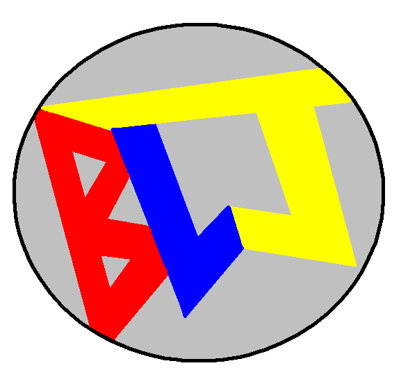

<!-- # Getting Started with Create React App

This project was bootstrapped with [Create React App](https://github.com/facebook/create-react-app).

## Available Scripts

In the project directory, you can run:

### `npm start`

Runs the app in the development mode.\
Open [http://localhost:3000](http://localhost:3000) to view it in the browser.

The page will reload if you make edits.\
You will also see any lint errors in the console.

### `npm test`

Launches the test runner in the interactive watch mode.\
See the section about [running tests](https://facebook.github.io/create-react-app/docs/running-tests) for more information.

### `npm run build`

Builds the app for production to the `build` folder.\
It correctly bundles React in production mode and optimizes the build for the best performance.

The build is minified and the filenames include the hashes.\
Your app is ready to be deployed!

See the section about [deployment](https://facebook.github.io/create-react-app/docs/deployment) for more information.

### `npm run eject`

**Note: this is a one-way operation. Once you `eject`, you can’t go back!**

If you aren’t satisfied with the build tool and configuration choices, you can `eject` at any time. This command will remove the single build dependency from your project.

Instead, it will copy all the configuration files and the transitive dependencies (webpack, Babel, ESLint, etc) right into your project so you have full control over them. All of the commands except `eject` will still work, but they will point to the copied scripts so you can tweak them. At this point you’re on your own.

You don’t have to ever use `eject`. The curated feature set is suitable for small and middle deployments, and you shouldn’t feel obligated to use this feature. However we understand that this tool wouldn’t be useful if you couldn’t customize it when you are ready for it.

## Learn More

You can learn more in the [Create React App documentation](https://facebook.github.io/create-react-app/docs/getting-started).

To learn React, check out the [React documentation](https://reactjs.org/).

### Code Splitting

This section has moved here: [https://facebook.github.io/create-react-app/docs/code-splitting](https://facebook.github.io/create-react-app/docs/code-splitting)

### Analyzing the Bundle Size

This section has moved here: [https://facebook.github.io/create-react-app/docs/analyzing-the-bundle-size](https://facebook.github.io/create-react-app/docs/analyzing-the-bundle-size)

### Making a Progressive Web App

This section has moved here: [https://facebook.github.io/create-react-app/docs/making-a-progressive-web-app](https://facebook.github.io/create-react-app/docs/making-a-progressive-web-app)

### Advanced Configuration

This section has moved here: [https://facebook.github.io/create-react-app/docs/advanced-configuration](https://facebook.github.io/create-react-app/docs/advanced-configuration)

### Deployment

This section has moved here: [https://facebook.github.io/create-react-app/docs/deployment](https://facebook.github.io/create-react-app/docs/deployment)

### `npm run build` fails to minify

This section has moved here: [https://facebook.github.io/create-react-app/docs/troubleshooting#npm-run-build-fails-to-minify](https://facebook.github.io/create-react-app/docs/troubleshooting#npm-run-build-fails-to-minify) -->

# BLJ 

###### Becky Louise Jones 🙋‍♀️ (me)

# 🎨 canvas-js-react 🖌️

## 🖼️ canvas pictures that are responsive 📱💻🖥️

## 😩 My Stress Relief 😌

During my time at the School of Code I was introduced to canvas. Something that I enjoy is animation and cartooning. I enjoy the intricacies of it the time, effort and energy that goes into creating just one second of motion (then adding the sounds, music and colour etc etc...)

## How I started 🏁

I started just making pictures using canvas and JavaScript together then transfered these to a react app. Whilst experimenting with this I found a blog and work that help me understanding how to make it render to different screen sizes. (There still some issues with scalability 🤏 so some pictures are a little fuzzy)

###### https://www.pluralsight.com/guides/render-window-resize-react

<!-- Chris Dobby -->

## What I used 🛠️

For general app construction
  

<ul>
    <li>React </li>
        <ul>
        <li>React Dom</li>
        <li>React Router Dom</li>
    </ul>
 </ul>

For app navigation and additonal css
  

<ul>
    <li>Bootstrap </li>
</ul>

## Inspiration 💡

###### (The reason behind each picture)

### No more stamps 🖃

This picture was inspired by the rising cost in stamps the repeated depletation of my bank balance and the annoyingly close space between all my family members birthdays 🎉

###### I have this one deployed individually and am going to do more so can send a link to my family on their birthday like a computerised birthday card 👍

### Everybodys Favourite Mouse 🐀

This picture was inspired by 'everyone favourite mouse'. As an animation fan there is NO ONE greater than Walter Elias Disney, what he has done for the world not just the world of animation or even tv and film but for the world in general is unlike anyone before or anyone since (and unlike anyone who ever will).

###### There is also an iconic Walt Disney quote and background pictures.

### Why? 🤔

This picture was inspired by my brain which sometimes has weird thoughts. The particular weird though is ' Why are T-rex arms so small?'
  
Somebody I met on the bootcamp (Emma) in a previous life (pre coding course) was a palaeontologist and I gave her this question and she had a good go at answering it (although she did give me the collection of theories behind it.... so slightly closer to the answer???)
  
So I turned my crazy thought into a funny little image (and not to forget Amelia who was a witness to the conversation I put in her favourite animal.)

###### (There is also a tribute to them below my drawing) 🦖 🐼

### #Thanks Piper 🦋

Piper is someone that I met whilst on the School of Code, we had an interesting chat about Pokemon and this was born from it.
  
The canvas drawing is of Pipers favourite (there is also an image below of what it is suppose to look like)

###### Charmander is my favourite and I've put my own tribute to him on the page as well.

## What to see? :eyes:

If you want to see you can open a localHost version by typing "npm run start" in the terminal
 

### Or a deployed version :computer:

https://blj-canvas.netlify.app/

There is space for more pictures (and believe me there will be)
